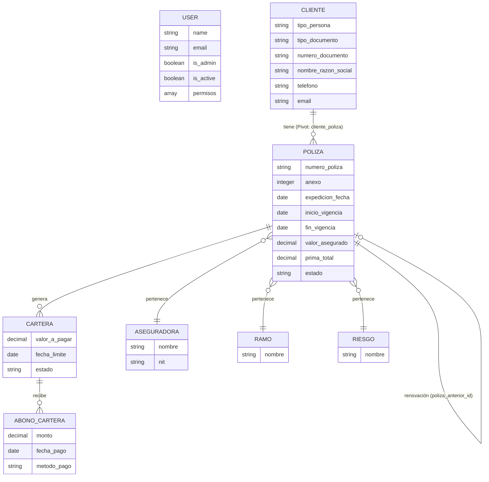

# Arquitectura y Diccionario de Datos - Canal360

Este documento proporciona una visión técnica detallada de la estructura de datos y las relaciones del sistema.

## 1. Diagrama de Entidad-Relación (ERD)

A continuación se muestra el modelo de datos principal y sus interconexiones.

## 2. Diccionario de Datos (Modelos Principales)

| Tabla | Campo | Tipo | Descripción |
| :--- | :--- | :--- | :--- |
| **users** | `name` | String | Nombre completo del usuario del sistema. |
| | `email` | String | Correo electrónico (identificador único para login). |
| | `is_admin` | Boolean | Define si el usuario tiene privilegios de administrador. |
| **clientes** | `numero_documento` | String | Cédula o NIT del cliente. |
| | `nombre_razon_social`| String | Nombre completo o Razón Social. |
| | `tipo_persona` | Enum | 'Natural' o 'Jurídica'. |
| **polizas** | `numero_poliza` | String | Identificador único de la póliza de seguros. |
| | `valor_asegurado` | Decimal | Monto total cubierto por la póliza. |
| | `estado` | String | Estado actual (Activa, Vencida, Cancelada). |
| **carteras** | `valor_a_pagar` | Decimal | Monto pendiente de cobro de la póliza. |
| | `estado` | String | Situación de pago (Pendiente, Pagado, Mora). |

## 3. Flujo de Datos Crítico: Ciclo de Vida de una Póliza

1.  **Creación:** Se registra el [Cliente](file:///c:/Users/CANAL%20ASESORES%20LTDA/Documents/Proyectos/Canal360/app/Models/Cliente.php#7-39) y se asocia a una nueva [Poliza](file:///c:/Users/CANAL%20ASESORES%20LTDA/Documents/Proyectos/Canal360/app/Models/Poliza.php#7-67).
2.  **Facturación:** La póliza genera automáticamente registros en [Cartera](file:///c:/Users/CANAL%20ASESORES%20LTDA/Documents/Proyectos/Canal360/app/Models/Cartera.php#7-56) según el plan de pagos.
3.  **Recaudo:** Se registran `Abonos` que disminuyen el saldo en [Cartera](file:///c:/Users/CANAL%20ASESORES%20LTDA/Documents/Proyectos/Canal360/app/Models/Cartera.php#7-56).
4.  **Renovación:** Al llegar al `fin_vigencia`, se puede disparar un proceso de renovación vinculando la póliza nueva con la anterior mediante `poliza_anterior_id`.
