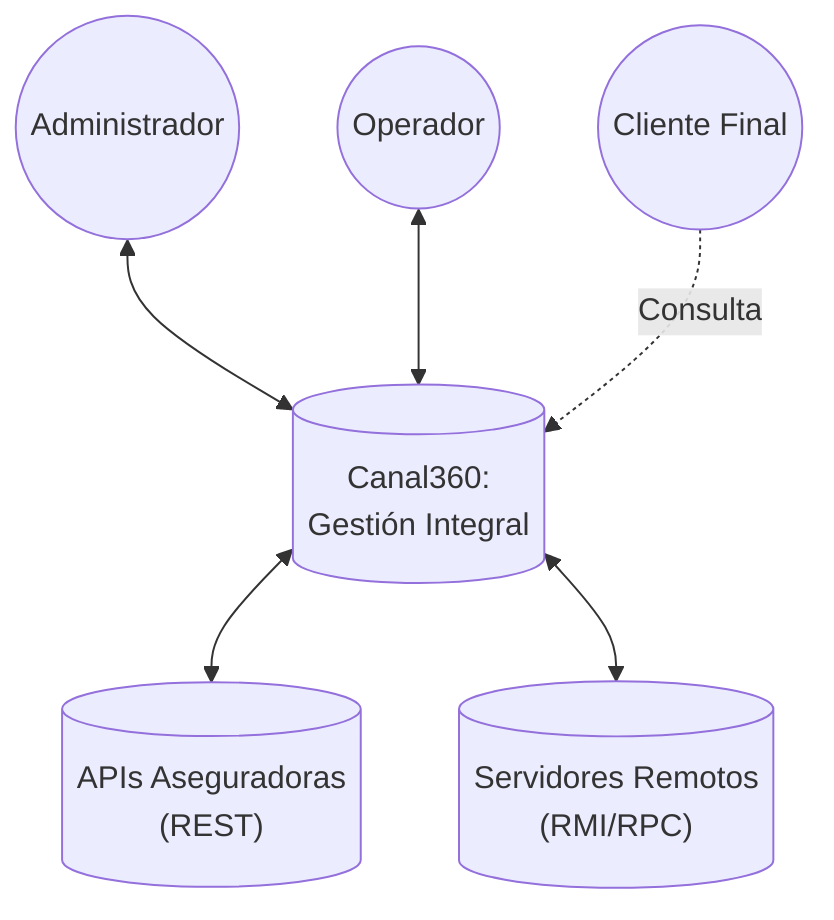
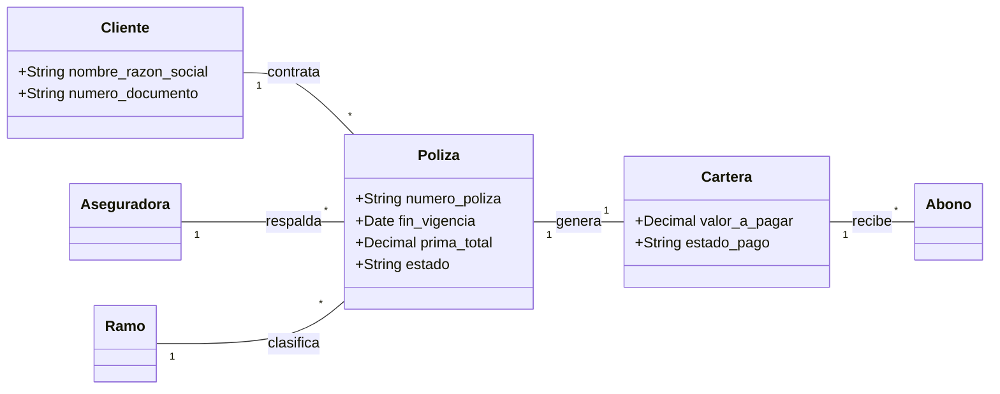

# Plan Maestro de Análisis y Diseño de Sistemas 🚀

Este documento constituye la hoja de ruta integral para la transformación de ideas de negocio en planos técnicos sólidos y entregables de alta calidad. Está diseñado para guiar al analista desde la concepción inicial hasta la trazabilidad final del desarrollo.

---

## 📋 Tabla de Contenido
1. [Fase 1: Cimentación y Contexto](#fase-1-cimentación-y-contexto)
2. [Fase 2: Definición Técnica de Requerimientos](#fase-2-definición-técnica-de-requerimientos)
3. [Fase 3: El Mundo de los Objetos](#fase-3-el-mundo-de-los-objetos)
4. [Fase 4: Trazabilidad y Cierre](#fase-4-trazabilidad-y-cierre)

---

## 🛠️ Fase 1: Cimentación y Contexto (Guías 1 y 2)
*El objetivo de esta fase es definir el alcance y los límites del sistema Canal360 antes del modelado detallado.*

### 1.1 Investigación Teórica y Técnicas de Relevamiento
Para este proyecto, se han aplicado las siguientes técnicas de captura de requisitos:
- **Técnica 1: Análisis de Artefactos:** Revisión profunda de la base de datos y modelos Eloquent para deducir las reglas de negocio implícitas.
- **Técnica 2: Entrevistas con Stakeholders:** (Simulado) Sesiones para definir el flujo de vida de una póliza de seguros.
- **Técnica 3: Análisis de Software Existente:** Evaluación de las integraciones con portales de aseguradoras y sistemas de "Anna".

### 1.2 Selección del Proyecto: Canal360
**Canal360** es una plataforma integral de gestión para agencias de seguros, diseñada para centralizar la operación de pólizas, control de cartera y seguimiento de minerales, con capacidades de interoperabilidad distributiva.

### 1.3 Identificación de Actores
- **Administrador (SuperUser):** Posee control total sobre el sistema, incluyendo la gestión de usuarios, auditoría de logs y configuraciones globales.
- **Operador de Seguros:** Encargado de la gestión de clientes, ramos, riesgos y el ciclo de vida de las pólizas (expedición, renovación y liquidación).
- **Operador Financiero:** Responsable del seguimiento de la cartera, registro de abonos y control de conciliaciones de pago.
- **Sistemas Externos (APIs):** Entidades como aseguradoras y servicios de monitoreo remoto que se comunican con Canal360 mediante protocolos REST y RMI/RPC.

### 1.4 Paquetes Funcionales
El sistema se organiza en los siguientes módulos lógicos:
- **Módulo de Seguros:** Gestión central de Clientes, Aseguradoras, Ramos, Riesgos y Pólizas.
- **Módulo de Cartera:** Control de facturación, estados de cuenta y recaudos de primas.
- **Módulo de Información (Minerales):** Seguimiento de precios de minerales, categorías y valores históricos.
- **Módulo de Administración:** Gestión de usuarios, roles de acceso mediante middleware y auditoría de acciones.
- **Módulo Técnico:** Implementación de simulación de sistemas distribuidos y monitoreo remoto.

### 1.5 Diagrama de Contexto
Refleja la interacción de Canal360 con su ecosistema externo.

---

## 📝 Fase 2: Definición Técnica de Requerimientos (Guías 3 y 4)
*Transformación de necesidades detectadas en declaraciones técnicas atómicas, medibles y prioritarias.*

### 2.1 Matriz de Requerimientos Bilingüe (Functional Requirements)
| ID | Requerimiento (Spanish) | Requirement (English) | Prioridad |
| :--- | :--- | :--- | :---: |
| **RF-01** | El sistema deberá permitir la gestión completa del ciclo de vida de una póliza (Creación, Edición, Consulta). | The system shall allow full lifecycle management of an insurance policy (Create, Edit, Query). | Alta |
| **RF-02** | El sistema deberá permitir la generación de renovaciones vinculando trazabilidad con pólizas anteriores. | The system shall allow the generation of renewals by linking traceability with previous policies. | Alta |
| **RF-03** | El sistema deberá registrar abonos financieros y actualizar saldos de cartera automáticamente. | The system shall record financial payments and automatically update portfolio balances. | Alta |
| **RF-04** | El sistema deberá restringir el acceso a módulos específicos mediante un sistema de permisos dinámicos. | The system shall restrict access to specific modules through a dynamic permission system. | Media |
| **RF-05** | El sistema deberá permitir la exportación de datos de pólizas y cartera a formatos compatibles (Excel/PDF). | The system shall allow the export of policy and portfolio data to compatible formats (Excel/PDF). | Media |
| **RF-06** | El sistema deberá soportar la simulación de servicios distribuidos vía RMI/RPC para pruebas de arquitectura. | The system shall support distributed services simulation via RMI/RPC for architecture testing. | Baja |

### 2.2 Requerimientos No Funcionales (Non-Functional Requirements)
- **Seguridad (Security):** Implementación de middleware `can.access` para validación de permisos a nivel de ruta y controlador.
- **Integridad (Integrity):** Uso del Trait `SoftDeletes` en modelos críticos para prevenir la pérdida accidental de datos.
- **Rendimiento (Performance):** El sistema debe procesar solicitudes de listado de cartera en menos de 2 segundos para volúmenes estándar.
- **Auditoría (Audit):** Registro automático de logs en el módulo `admin/auditoria` para cada cambio de estado en pólizas.

### 2.3 Backlog y Priorización
La priorización se ha definido utilizando la metodología MoSCoW, centrando el desarrollo inicial en el núcleo operativo (Seguros y Cartera).

| Iteración | Requerimientos Incluidos | Objetivo |
| :--- | :--- | :--- |
| **Sprint 1** | RF-01, RF-04, RNF-01 | MVP: Gestión básica de pólizas con seguridad. |
| **Sprint 2** | RF-02, RF-03, RF-05 | Gestión financiera y reportes. |
| **Sprint 3** | RF-06, RNF-04 | Optimizaciones, Auditoría y Pruebas Distribuidas. |

### 2.4 Control de Calidad y Redacción Atómica
Se ha evitado la ambigüedad eliminando términos subjetivos. No se indica "el sistema será rápido", sino "el sistema deberá responder en < 2 segundos", cumpliendo con el estándar de calidad de la Guía 4.

---

## 🏗️ Fase 3: El "Mundo de los Objetos" (Guías 5 y 6)
*Modelado semántico de la lógica de negocio mediante el paradigma orientado a objetos, abstrayendo la implementación técnica.*

### 3.1 Análisis Lingüístico y Clases Conceptuales
Tras el análisis de los requerimientos, se han extraído las siguientes clases que componen el núcleo del sistema:
- **Póliza:** Entidad central que representa el contrato de seguro.
- **Cliente:** Persona natural o jurídica que adquiere el servicio.
- **Aseguradora:** Compañía proveedora del respaldo técnico.
- **Cartera:** Representación financiera del compromiso de pago.
- **Abono:** Registro individual de flujo de caja hacia la cartera.
- **Ramo/Riesgo:** Clasificaciones técnicas del objeto asegurado.

### 3.2 Modelo de Dominio (UML Diagram)

### 3.3 Catálogo de Reglas de Negocio (RN)
Estas leyes rigen el comportamiento consistente de los objetos en el sistema:
- **RN-01 (Integridad):** Una `Póliza` no puede ser eliminada físicamente si tiene registros asociados en `Cartera` (SoftDelete obligatorio).
- **RN-02 (Trazabilidad):** Toda renovación debe contener la referencia `poliza_anterior_id` para mantener el histórico de vigencias.
- **RN-03 (Consistencia):** El estado de una `Cartera` cambia automáticamente a 'Pagado' solo cuando la sumatoria de sus `Abonos` sea igual o superior a la `prima_total` de la póliza.

### 3.4 Matriz de Asignación (Clase vs Regla)
| Clase | Regla de Negocio | Impacto en el Modelo |
| :--- | :--- | :--- |
| **Poliza** | RN-01, RN-02 | Determina el flujo de vida y persistencia. |
| **Cartera** | RN-03 | Determina la lógica de actualización financiera. |
| **Abono** | RN-03 | Entidad disparadora de cambios de estado en Cartera. |

---

## 📉 Fase 4: Trazabilidad y Cierre (Guía 7)
*El paso final para asegurar que el diseño técnico es coherente con los requerimientos y que no existe sobrediseño o funcionalidades faltantes.*

### 4.1 Matriz de Trazabilidad de Requerimientos (RTM)
Esta matriz permite verificar que cada funcionalidad requerida tiene un respaldo en el diseño de objetos y cumple con las reglas de negocio establecidas.

| ID Requerimiento | Descripción Breve | Clase Asociada (Modelo) | Regla de Negocio (RN) | Estado de Diseño |
| :--- | :--- | :--- | :--- | :---: |
| **RF-01** | Gestión de Pólizas | `Poliza` | RN-01, RN-02 | Completo |
| **RF-02** | Renovaciones | `Poliza` | RN-02 | Completo |
| **RF-03** | Cartera y Abonos | `Cartera`, `Abono` | RN-03 | Completo |
| **RF-04** | Permisos de Acceso | `Middleware / User` | - | Completo |
| **RF-06** | Simulación Distribuida| `RemoteMonitor` | - | En Pruebas |
| **RNF-01** | Integridad (SoftDelete) | Transversal | RN-01 | Completo |

### 4.2 Auditoría de "Huérfanos" y Calidad
Tras el cruce de información, se concluye lo siguiente:
- **Sin Funcionalidades Faltantes:** Todos los requerimientos de la Fase 2 tienen al menos una clase y una regla asociada.
- **Sin Sobrediseño (Gold Plating):** No se han identificado clases en el modelo de dominio que no respondan a un requerimiento funcional específico.
- **Coherencia Técnica:** La implementación de `SoftDeletes` y `Serializable` (para RMI) respalda directamente los requerimientos de integridad y simulación.

### 4.3 Consolidación Final y Entrega
El presente **Plan Maestro de Análisis y Diseño** queda consolidado como el documento técnico rector para el proyecto **Canal360**. Se recomienda su revisión periódica ante la adición de nuevos módulos operativos para mantener la trazabilidad actualizada.

---
*Fin del Documento - Unidad 2*
*Analista Encargado: cristian31306*
*Fecha de Consolidación: 15 de Abril de 2026*
